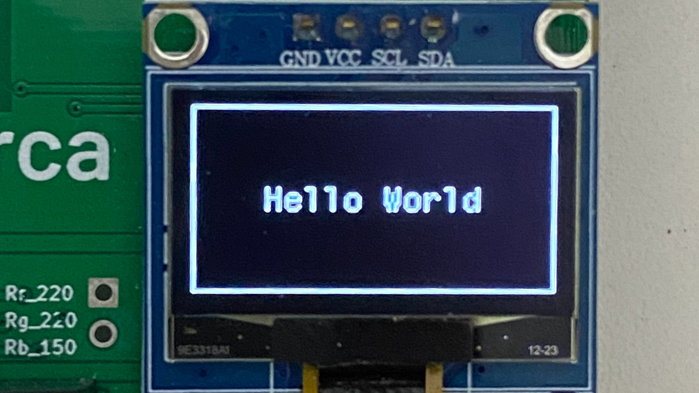

# SSD1306 Library for Raspberry Pi Pico W

## Introduction
This library is designed to simplify the use of the **SSD1306 OLED display** with the *Raspberry Pi Pico W*. The SSD1306 is a popular **monochrome OLED display**, widely used in electronics projects due to its high resolution and low power consumption. The code present in this library was written in C and the working environment used was **Visual Studio Code**, using the *Raspberry Pi Pico* extension present in the development tool. This library provides an easy-to-use interface for:
- Display initialization
- Drawing geometric shapes
- Rendering text and graphics
- Controlling display settings

## Purpose
The primary goal of this library is to **streamline** the process of interfacing with the **SSD1306** using the **Raspberry Pi Pico W**. By using this library, developers can quickly integrate the display into their projects without handling low-level **I2C** communication.

## Features
### Initialization
- `ssd1306_Init()`: Initializes the SSD1306 display, sets up I2C communication, and clears the screen.

### Display Control
- `ssd1306_SetDisplayOn(bool on)`: Turns the display on/off.
- `ssd1306_SetContrast(uint8_t contrast)`: Adjusts the display contrast.
- `ssd1306_UpdateScreen()`: Updates the display with the contents of the screen buffer.

### Drawing Shapes
- `ssd1306_DrawPixel(int x, int y, bool color)`: Draws a pixel at `(x, y)`.
- `ssd1306_DrawLine(int x1, int y1, int x2, int y2, bool color)`: Draws a line using **Bresenham's algorithm**.
- `ssd1306_DrawRectangle(int x, int y, int w, int h, bool color)`: Draws a rectangle.
- `ssd1306_FillRectangle(int x, int y, int w, int h, bool color)`: Draws a filled rectangle.
- `ssd1306_DrawCircle(int x, int y, int r, bool color)`: Draws a circle using **Bresenham's algorithm**.
- `ssd1306_FillCircle(int x, int y, int r, bool color)`: Draws a filled circle.

### Text Rendering
- `ssd1306_WriteChar(char ch, FontDef font, bool color)`: Writes a character using a specified font.
- `ssd1306_WriteString(const char* str, FontDef font, bool color)`: Writes a string using a specified font.
- `ssd1306_SetCursor(int x, int y)`: Sets the cursor position for text rendering.

### Buffer Manipulation
- `ssd1306_Fill(bool color)`: Fills the screen buffer with a color (black/white).
- `ssd1306_FillBuffer(uint8_t* buffer, size_t size)`: Fills the screen buffer with data from an external buffer.

### Low-Level Functions
- `ssd1306_WriteCommand(uint8_t command)`: Sends a command to the display.
- `ssd1306_WriteData(uint8_t data)`: Sends data to the display.
- `ssd1306_Reset()`: Resets the display (for I2C, this function has no effect).

## Getting Started




### 1. **Installation**
- First, you must clone this repository to your personal local workspace.

```sh
$ git clone https://github.com/gabrielmdrss/Pico_SSD1306_Library.git
```

&nbsp;&nbsp;&nbsp;&nbsp;

- Now, you will have this entire repository downloaded but you will only need the "ssd1306" directory. So, after cloning the repository, paste the ssd1306 folder into your personal project and add these lines to your CMakeLists.txt, ensuring the addition of the executable files present in this library.
  
```c
add_executable(ssd1306_Lib
        main.c
        ssd1306/ssd1306.c
        ssd1306/ssd1306_fonts.c
        )
```

&nbsp;&nbsp;&nbsp;&nbsp;

- After that, just include the two files to use the functions and fonts present in the library.
  
```c
#include "ssd1306/ssd1306.h"
#include "ssd1306/ssd1306_fonts.h"
```


### 2. **Hardware Setup**
Connect the **SSD1306 OLED display** to the **Raspberry Pi Pico W** using **I2C**:

| OLED Pin | Pico W Pin |
|----------|-----------|
| VCC      | 3.3V      |
| GND      | GND       |
| SDA      | 14 (I2C1) |
| SCL      | 15 (I2C1) |

### 3. **Example Code**
Here’s a simple example to initialize the display and show text:

```c
#include "ssd1306/ssd1306.h"
#include "ssd1306/ssd1306_fonts.h"

int main() {

    stdio_init_all();           // Initialize all of the present standard stdio types that are linked into the binary.

    ssd1306_Init();             // Initialize the display
    ssd1306_Fill(Black);        // Fill the display with black color

    ssd1306_DrawRectangle(0, 0, 127, 63, White);            // Draw a rectangle from (0, 0) to (127, 31) with white color
    ssd1306_SetCursor(25, 28);                              // Set the cursor to the position (25, 28)
    ssd1306_WriteString("Hello World", Font_7x10, White);   // Write the string "Hello World" to the display
    ssd1306_UpdateScreen();                                 // Update the display

    while (1);
    
    return 0;
}
}
```

## Conclusion
The **SSD1306 Library for Raspberry Pi Pico W** is a powerful tool for developers looking to integrate **OLED displays** into their projects. With functions for **initialization, display control, shape drawing, and text rendering**, the library simplifies development and enables the creation of **clean and interactive** user interfaces.

---
